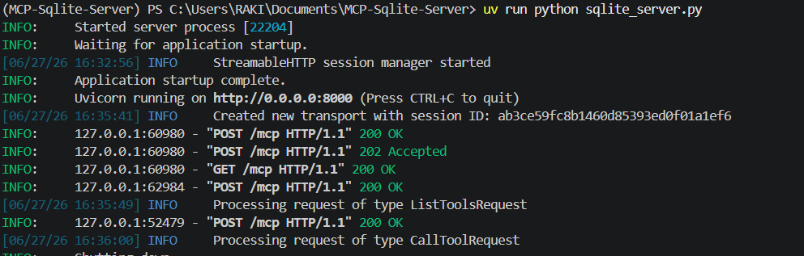
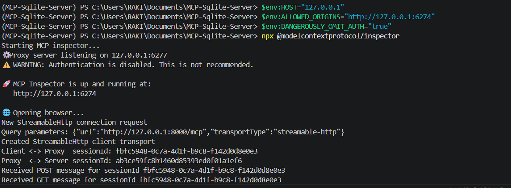
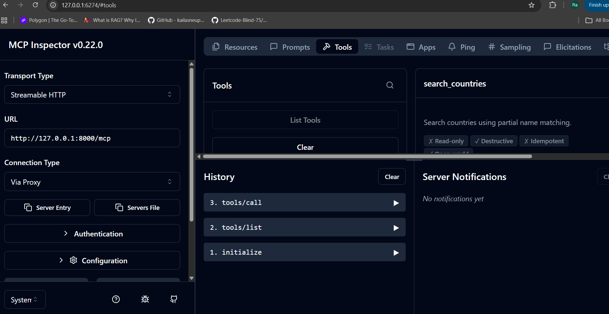
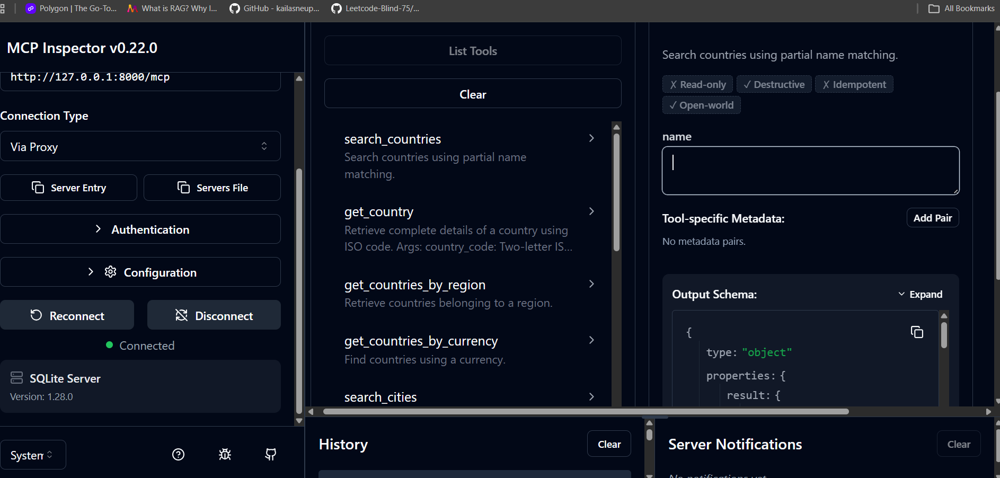
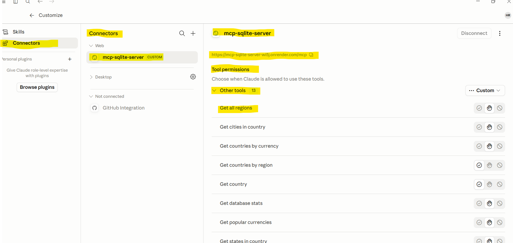
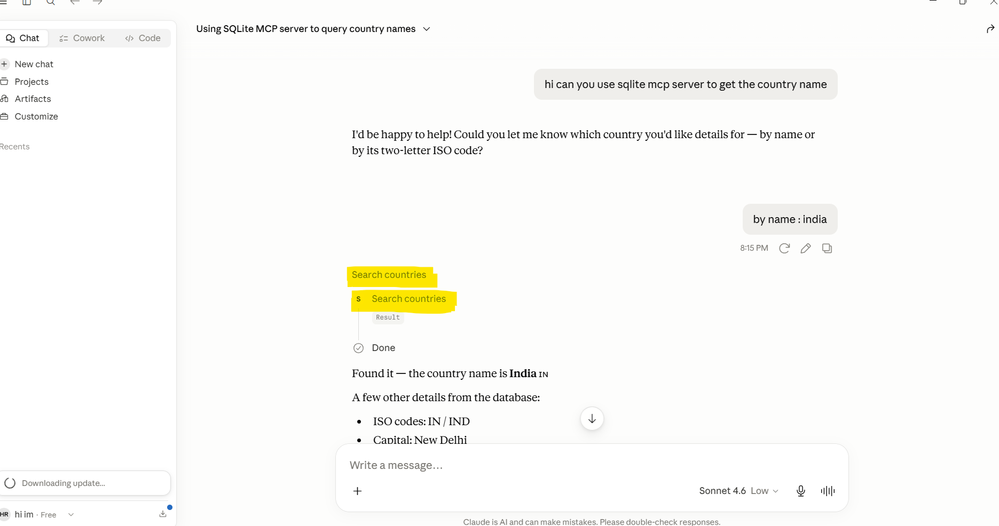
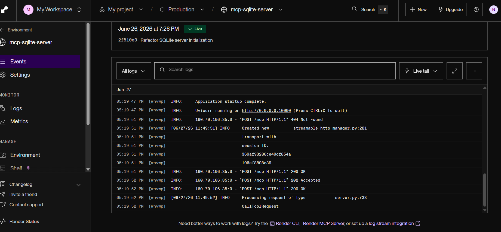
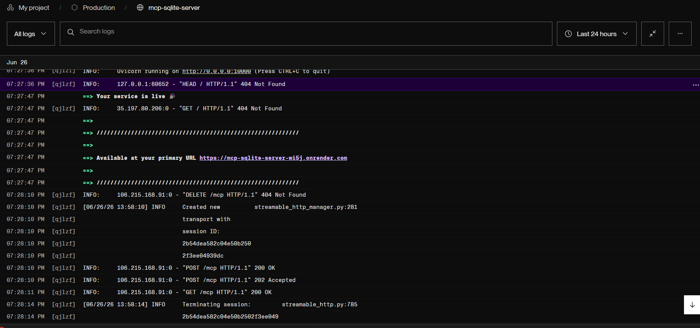

# SQLite MCP Server

A production-ready **Model Context Protocol (MCP) Server** built with **FastMCP** that exposes SQLite databases as AI tools over **Streamable HTTP**. The server is deployed on **Render** and can be accessed by MCP-compatible clients such as Claude Desktop and the MCP Inspector.

---

## Overview

This project demonstrates how to build and deploy an MCP Server that allows AI assistants to interact with SQLite databases through predefined tools instead of writing SQL directly.

The application follows a modular architecture, making it easy to add new tools and databases while keeping the codebase clean and maintainable.

---

## Features

* FastMCP Server
* Streamable HTTP Transport
* SQLite Database Integration
* Modular Tool Registration
* Multiple Database Support
* Deployed on Render
* Claude Desktop Compatible
* MCP Inspector Compatible

---

## Project Structure

```text
MCP-Sqlite-Server/
│
├── db/
│   ├── world.db
│   └── community.db
│
├── config/
│   ├── server.py
│   └── settings.py
│
├── tools/
│   ├── __init__.py
│   ├── city_tools.py
│   ├── country_tools.py
│   ├── community_tools.py
│   ├── region_tools.py
│	├── state_tools.py
│   └── stats.py
│
├── utils/
│   ├── __init__.py
│   ├── db.py
│   
│
├── sqlite_server.py
├── pyproject.toml
├── uv.lock
├── README.md
└── .gitignore
```


---

# Tech Stack

* Python
* FastMCP
* SQLite
* Uvicorn
* UV
* Render

---

# Architecture

```text
Claude Desktop / MCP Inspector
             │
             ▼
     Streamable HTTP
             │
             ▼
      FastMCP Server
             │
     ┌───────┼────────┐
     ▼       ▼        ▼
   City   Country  Community
   Tools    Tools     Tools
             │
             ▼
      SQLite Databases
```

---

# Clone the Repository

```bash
git clone https://github.com/raki0230/MCP-Sqlite-Server.git

cd MCP-Sqlite-Server
```

---

# Install Dependencies

```bash
uv sync
```

---

# Run the Server on one terminal

```bash
uv run python sqlite_server.py
```

The server starts on:

```text
(MCP-Sqlite-Server) PS C:\Users\RAKI\Documents\MCP-Sqlite-Server> uv run python sqlite_server.py
INFO:     Started server process [22204]
INFO:     Waiting for application startup.
[06/27/26 16:32:56] INFO     StreamableHTTP session manager started                                                               streamable_http_manager.py:131
INFO:     Application startup complete.
INFO:     Uvicorn running on http://0.0.0.0:8000 (Press CTRL+C to quit)
```



---

# Test Using MCP Inspector in other terminal

Launch the MCP Inspector.

```bash
$env:HOST="127.0.0.1" 
$env:ALLOWED_ORIGINS="http://127.0.0.1:6274" 
$env:DANGEROUSLY_OMIT_AUTH="true"
npx @modelcontextprotocol/inspector
```



Configure:

| Field     | Value                     |
| --------- | ------------------------- |
| Transport | Streamable HTTP           |
| URL       | http://127.0.0.1:8000/mcp |

Click **Connect** to discover all available tools.




*MCP Inspector connected and displaying registered tools*

---

# Connect with Claude Desktop

Add the deployed MCP Server to your Claude Desktop connectors.



Restart Claude Desktop.

Once connected, Claude can invoke the registered SQLite tools directly through MCP.



*Claude Desktop successfully calling SQLite MCP tools*

---

# Deployment

The server is deployed on **Render** using the Streamable HTTP transport, making it accessible from any MCP-compatible client.

Deployment Highlights:

* Hosted on Render
* Public HTTPS Endpoint
* Streamable HTTP Transport
* Ready for Claude Desktop Integration





*Render dashboard showing successful deployment*

---

# Available Tools

### City Tools

* Retrieve city information
* Search cities
* View city statistics

### Country Tools

* Retrieve country information
* Population lookup
* Country statistics

### Community Tools

* Retrieve community information
* Search communities
* Community statistics

---

# End-to-End Workflow

```text
User
   │
   ▼
Claude Desktop
   │
   ▼
MCP Request
   │
   ▼
SQLite MCP Server
   │
   ▼
SQLite Database
   │
   ▼
Structured Response
   │
   ▼
Claude Response
```

---

# Why Model Context Protocol?

Model Context Protocol (MCP) standardizes how AI applications communicate with external tools and data sources. Instead of allowing an LLM to generate SQL, the server exposes trusted database operations as MCP tools, providing a more secure, maintainable, and extensible integration.

---

# Author

**Ratna Kiran**

GitHub: https://github.com/raki0230

Medium: https://medium.com/@n.raki2331

LinkedIn: https://www.linkedin.com/in/ratna-kiran-b95010233
